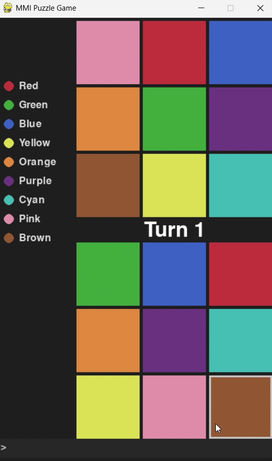

🎮 MMI Puzzle Game

A simple but challenging puzzle game that explores multimodal interaction—control it with your mouse, your voice, or both at the same time!

The goal is to rearrange the bottom grid of colors to perfectly match the pattern in the top grid.



---

## ✨ Features

Classic Mouse Controls: Click to select and swap adjacent tiles.

Voice Commands: Control the entire game with your voice.

Swap tiles by naming their colors (e.g., "swap red and blue").

Shuffle the board with a simple command.

Modality Fusion: Combine mouse and voice for advanced commands! Just point at a tile with your mouse and say "swap this with green" to perform a complex action easily.

Modality Fission: The game is smart enough to resolve conflicts. If you start an action with the mouse, it will ignore voice commands until you're done, avoiding any confusion.

---

## 🚀 Getting Started

Follow these steps to get the game running on your local machine.

1. Prerequisites
Python 3.8+

A working microphone

An internet connection (for the voice recognition API)

2. Installation & Setup
First, clone the repository to your machine:

```bash
git clone https://github.com/cedush/mmi-puzzle-game.git
cd mmi-puzzle-game
```

Next, it's a good idea to create a virtual environment to keep dependencies clean:

```bash
# Create a virtual environment
python -m venv venv

# Activate it
## On Windows:
venv\Scripts\activate
## On macOS/Linux:
source venv/bin/activate
```

Finally, install the required packages:

```bash
pip install -r requirements.txt
```

---

## 🕹️ How to Play

With your virtual environment activated, simply run the main script:

```bash
python main.py
```

Controls
🖱️ Mouse
Click a tile: Selects it.

Click an adjacent tile: Swaps it with the selected tile.

Click the selected tile again: Deselects it.

🎤 Voice
"swap [color1] and [color2]": Swaps two adjacent colored tiles.

"swap this with [color]": (While hovering the mouse over a tile) Swaps the hovered tile with the named color tile.

"shuffle": Resets the puzzle grid to a new random state.

## 🛠️ Built With
Python

Pygame - For the game engine and graphics.

SpeechRecognition - For processing voice commands.
